# GitHub地址 #
* [泛聊](https://github.com/uncleleonfan/FanChat)
* [其他IM开源项目](https://www.imgeek.org/code/)

# 项目简介 #
本项目是即时通讯的示例项目，使用了MVP模式，集成了环信SDK和Bmob后端云，展示了即时通讯基本功能的实现，包括注册登录，退出登录，联系人列表，添加好友，删除好友，收发消息，消息提醒等功能。
## 使用的开源项目 ##
* [BottomBar](https://github.com/roughike/BottomBar)
* [EventBus](https://github.com/greenrobot/EventBus)
* [greenDAO](https://github.com/greenrobot/greenDAO)
* [butterknife](https://github.com/JakeWharton/butterknife)

## 学习目标 ##
* 环信SDK的集成与使用
* MVP模式的运用
* ORM数据库的集成与使用
* 模块化思想的运用

# 即时通讯 IM(Instant Messaging)#
>允许两人或多人使用网络即时的传递文字讯息、档案、语音与视频交流。

## 相关产品 ##
* 鼻祖 ICQ
* 国内主流 QQ 微信 陌陌 YY等
* 国外主流 Facebook Messenger WhatsApp Skype Instagram Line

## 第三方服务平台 ##
* [环信](http://www.easemob.com/product/cs?utm_source=baidu-pp)
* [融云](http://www.rongcloud.cn/)
* [网易云信](http://netease.im/)
* [极光IM](https://www.jiguang.cn/im)
* [腾讯云通信IM](https://www.qcloud.com/product/im.html)
* [爱萌](http://www.imsdk.im/)
* [阿里悟空(2016年10月31号正式下线)](http://www.imwukong.com/)
* [阿里百川云旺](http://im.taobao.com/)

# 环信 #
[官网](http://www.easemob.com/product/cs?utm_source=baidu-pp)

[即时通信云3.x文档](http://docs.easemob.com/im/start)

## 环信原理 ##
环信基于XMPP协议，XMPP基于Socket, 通过Socket保持长连接。

## 环信集成 ##
1. [注册并创建应用](http://docs.easemob.com/im/000quickstart/10register)
2. [下载SDK](http://www.easemob.com/download/im)
3. [SDK的导入](http://docs.easemob.com/im/200androidclientintegration/10androidsdkimport)
4. [SDK的初始化](http://docs.easemob.com/im/200androidclientintegration/30androidsdkbasics)

### .so文件夹 ###
1. 放在jniLibs
2. 也可以放在libs目录下，不过需要在模块下的配置文件中配置
	
		android {
			sourceSets {
		        main {
		            jniLibs.srcDirs = ['libs']
		        }
		    }
		}

### 巨坑 ###
运行出错：Didn't find class "com.hyphenate.chat.adapter.EMACallSession"，原因是hyphenatechat_3.2.0.jar包内没有该类。

解决办法:导入Demo源码中EaseUI库里面的hyphenatechat_3.2.0.jar替换。

# 软件架构 #

## MVC ##

MVC应用于Ruby on Rails, Spring Framework, iOS开发和 ASP.NET等。

* Model: 获取数据的业务逻辑，网络操作，数据库操作
* View: UI
* Controller: 操作Model层获取数据传递给UI

### 服务器端的MVC ###

### Android中MVC ###
Android中并没有清晰的MVC框架，如果把Activity当做Controller,根据我们实际开发经验，里面会有大量的UI操作，所以V和C就傻傻分不清了。

* Model:Java Bean, NetworkManager, DataBaseHelper
* View: xml res
* Controller: Activity Fragment
* ArrayList-ListView-Adapter(MVC)

## MVP ##
MVP主要应用于ASP.NET等。**MVP与MVC主要区别是View和Model不再耦合。**

* Model: 获取数据的业务逻辑，网络操作，数据库操作
* View: UI
* Presenter: 操作Model层获取数据传递给UI

## MVVM ##
MVVM主要应用于WPF, Silverlight, Caliburn, nRoute等。

* Model: 获取数据的业务逻辑，网络操作，数据库操作
* View: UI
* ViewModel: 将View和Model绑定

### Android中MVVM ###
[Data Binding Library](https://developer.android.com/topic/libraries/data-binding/index.html)
[中文翻译](http://www.jianshu.com/p/b1df61a4df77)

## 软件架构的核心思想 ##
>分层分模块

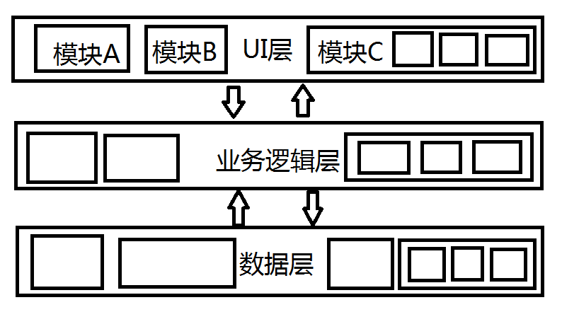

## 参考 ##

* [MVC,MVP和MVVM模式如何选择](http://www.jianshu.com/p/6a86f7fdc0cb)

* [教你认清MVC，MVP和MVVM](http://zjutkz.net/2016/04/13/%E9%80%89%E6%8B%A9%E6%81%90%E6%83%A7%E7%97%87%E7%9A%84%E7%A6%8F%E9%9F%B3%EF%BC%81%E6%95%99%E4%BD%A0%E8%AE%A4%E6%B8%85MVC%EF%BC%8CMVP%E5%92%8CMVVM/)

* [android architecture](https://github.com/googlesamples/android-architecture)

* [Understanding MVC, MVP and MVVM Design Patterns](http://www.dotnettricks.com/learn/designpatterns/understanding-mvc-mvp-and-mvvm-design-patterns)

* [Android Data Binding](https://github.com/LyndonChin/MasteringAndroidDataBinding)

* [Clean Architecture](http://fernandocejas.com/2014/09/03/architecting-android-the-clean-way/)

# 准备好了么？ 开车啦！！！ #
## 包的创建 ##
* adapter 存放适配器
* app 存放常量类，Application类以及一些app层级的全局类
* database 数据库相关类
* event EventBus使用的事件类
* factory 工厂类
* model 数据模型
* presenter MVP模型中的Presenter类
* ui 存放activity和fragment
* utils 工具类
* view MVP模型中的View类
* widget 自定义控件

## 基类的创建 ##
* BaseActivity
* BaseFragment

# Splash界面 #

## 功能需求 ##
1. 如果没有登录，延时2s, 跳转到登录界面
2. 如果已经登录，则跳转到主界面

## MVP实现 ##
* SplashView
* SplashPresenter

## 判断是否登录环信 ##
    @Override
    public void checkLoginStatus() {
        if (EMClient.getInstance().isLoggedInBefore() && EMClient.getInstance().isConnected()) {
            mSplashView.onLoggedIn();
        } else {
            mSplashView.onNotLogin();
        }
    }

# 登录界面 #
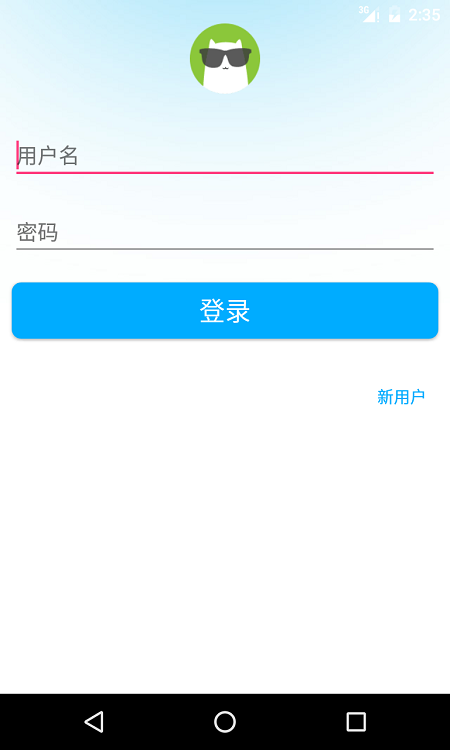

## 功能需求 ##
1. 点击登录按钮或者点击虚拟键盘上的Action键都能发起登录操作
2. 点击新用户，跳转到注册界面。

	
## MVP实现 ##
* LoginView
* LoginPresenter

## IME Options##
**注意配置EditText的imeOptions属性时，需要配合inputType才能起作用。**

	android:imeOptions="actionNext"//下一个
	android:imeOptions="actionGo"//启动
	android:imeOptions="actionDone"//完成
	android:imeOptions="actionPrevious"//上一个
	android:imeOptions="actionSearch"//搜索
	android:imeOptions="actionSend"//发送

## 监听软键盘Action事件，发起登录 ##
    private TextView.OnEditorActionListener mOnEditorActionListener = new TextView.OnEditorActionListener() {

        @Override
        public boolean onEditorAction(TextView v, int actionId, KeyEvent event) {
            if (actionId == EditorInfo.IME_ACTION_GO) {
                startLogin();
                return true;
            }
            return false;
        }
    };

## EMCallBack的适配器 ##
EMCallBack是环信的一个请求回调接口，包括请求成功的回调onSuccess,请求失败的回调onError和请求进度回调onProgress,
但在实际使用过程中，通常只使用到请求成功和失败的回调，请求进度回调通常留在那里成了一个空方法，对于一个有
代码洁癖的搬砖师来说，这是很难受的。所以我们可以创建一个适配器类实现这个接口，使用时用适配器类来替换EMCallBack
接口，这样只需要覆写我们想覆写的方法就可以了。

	//EMCallBack接口的适配器
	public class EMCallBackAdapter implements EMCallBack{
	
	    @Override
	    public void onSuccess() {
	
	    }
	
	    @Override
	    public void onError(int i, String s) {
	
	    }
	
	    @Override
	    public void onProgress(int i, String s) {
	
	    }
	}

	//EMCallBack适配器的使用
    private EMCallBackAdapter mEMCallBack = new EMCallBackAdapter() {

        @Override
        public void onSuccess() {
            ThreadUtils.runOnUiThread(new Runnable() {
                @Override
                public void run() {
                    mLoginView.onLoginSuccess();
                }
            });
        }

        @Override
        public void onError(int i, String s) {
            ThreadUtils.runOnUiThread(new Runnable() {
                @Override
                public void run() {
                    mLoginView.onLoginFailed();
                }
            });
        }
    };

## Android6.0动态权限管理 ##
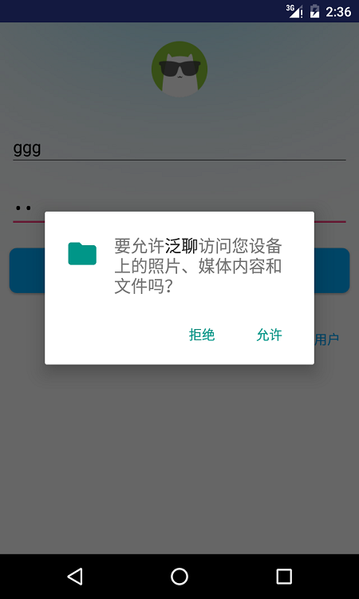

Andrioid6.0对权限进行了分组，涉及到用户敏感信息的权限只能动态的去获取。当应用的targetSdkVersion小于23时，
会默认采用以前的权限管理机制，当targetSdkVersion大于等于23时并且运行在Andorid6.0系统上，它才会采用这套新的权限管理机制。

### 参考 ###
* [适配Android6.0动态权限管理](http://www.jianshu.com/p/a37f4827079a)
* [Android6.0权限管理的解析与实战](http://www.jianshu.com/p/a1edba708761)

### 动态获取写磁盘权限 ###
环信SDK内部维护了一个数据库来存储聊天记录等数据，需要读写磁盘的权限，所以我们在用户登录之前要申请该权限。
类似的，很多同学在集成百度地图或者高德地图时常常不能正常定位，往往是忽略了在Android6.0上需要获取位置的权限。

    /**
     * 是否有写磁盘权限
     */
    private boolean hasWriteExternalStoragePermission() {
        int result = ActivityCompat.checkSelfPermission(this, Manifest.permission.WRITE_EXTERNAL_STORAGE);
        return result == PermissionChecker.PERMISSION_GRANTED;
    }

    /**
     * 申请权限
     */
    private void applyPermission() {
        String[] permissions = {Manifest.permission.WRITE_EXTERNAL_STORAGE};
        ActivityCompat.requestPermissions(this, permissions, REQUEST_WRITE_EXTERNAL_STORAGE);
    }

    /**
     * 申请权限回调
     */
    @Override
    public void onRequestPermissionsResult(int requestCode, @NonNull String[] permissions, @NonNull int[] grantResults) {
        switch (requestCode) {
            case REQUEST_WRITE_EXTERNAL_STORAGE:
                if (grantResults[0] == PermissionChecker.PERMISSION_GRANTED) {
                    login();
                } else {
                    toast(getString(R.string.not_get_permission));
                }
                break;
        }
    }

# 注册界面 #

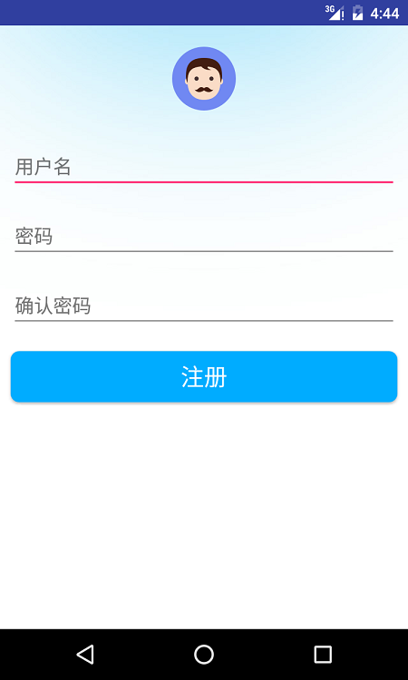
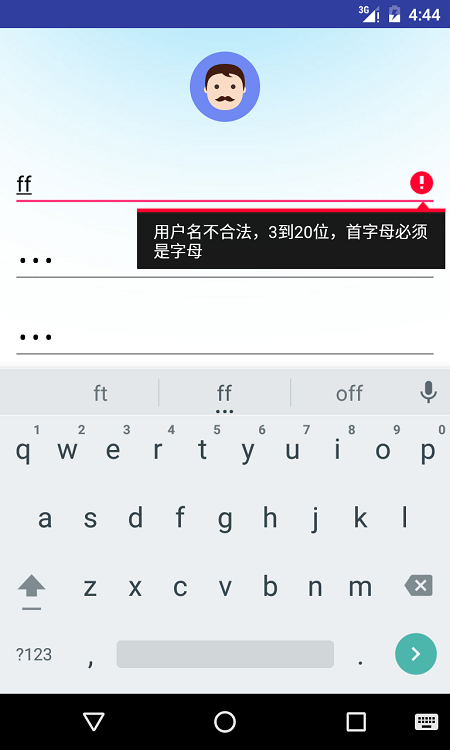

## 功能需求 ##
1. 用户名的长度必须是3-20位，首字母必须为英文字符，其他字符则除了英文外还可以是数字或者下划线。
2. 密码必须是3-20位的数字。
3. 密码和确认密码一致

## MVP实现 ##
* RegisterView
* RegisterPresenter

## 正则表达式 ##
[正则表达式-元字符](http://www.runoob.com/regexp/regexp-metachar.html)

	private static final String USER_NAME_REGEX = "^[a-zA-Z]\\w{2,19}$";//用户名的正则表达式
    private static final String PASSWORD_REGEX = "^[0-9]{3,20}$";//密码的正则表达式

* ^ 匹配输入字符串的开始位置
* [a-zA-Z] 	字符范围。匹配指定范围内的任意字符。
* \w 匹配包括下划线的任何单词字符。等价于'[A-Za-z0-9_]'。
* $ 匹配输入字符串的结束位置

## 注册流程 ##
1. 实际项目中，注册会将用户名和密码注册到APP的服务器，然后APP的服务器再通过REST API方式注册到环信服务器。
2. 由于本项目没有APP服务器，会将用户数据注册到第三方云数据库Bmob，注册成功后，再在客户端发送请求注册到环信服务器。

## 云数据库 ##
* [LeanCloud](https://leancloud.cn/)
* [Bmob](http://www.bmob.cn/)
* [Parse](https://parse.com/)(2017年1月28日关闭)

## Bmob集成 ##
[Bmob开发文档](http://docs.bmob.cn/data/Android/b_developdoc/doc/index.html)

1. 注册创建应用
2. 下载SDK
3. 导入SDK
4. 初始化SDk

## 隐藏软键盘 ##
在点击注册按钮发起注册流程后，我们需要隐藏掉软键盘并且弹出进度条。

	protected void hideSoftKeyboard() {
        if (mInputMethodManager == null) {
            mInputMethodManager = (InputMethodManager) getSystemService(INPUT_METHOD_SERVICE);
        }
        mInputMethodManager.hideSoftInputFromWindow(getCurrentFocus().getWindowToken(), 0);
    }

## 注册用户到Bmob ##
[Bmob用户管理](http://docs.bmob.cn/data/Android/b_developdoc/doc/index.html#用户管理)

    private void registerBmob(final String userName, final String pwd) {
        User user = new User(userName, pwd);
        user.signUp(new SaveListener<User>() {
            @Override
            public void done(User user, BmobException e) {
                if (e == null) {
                    registerEaseMob(userName, pwd);
                } else {
                    notifyRegisterFailed(e);
                }
            }
        });
    }

## 注册到环信 ##

    private void registerEaseMob(final String userName, final String pwd) {
        ThreadUtils.runOnBackgroundThread(new Runnable() {
            @Override
            public void run() {
                try {
                    EMClient.getInstance().createAccount(userName, pwd);
                    ThreadUtils.runOnUiThread(new Runnable() {
                        @Override
                        public void run() {
                            mRegisterView.onRegisterSuccess();
                        }
                    });
                } catch (HyphenateException e) {
                    e.printStackTrace();
                    ThreadUtils.runOnUiThread(new Runnable() {
                        @Override
                        public void run() {
                            mRegisterView.onRegisterError();
                        }
                    });
                }
            }
        });
    }

## 用户名已注册的处理 ##
当我们注册一个用户名到Bmob云数据库后，使用相同的用户名再次注册，Bmob会返回错误码202，信息为username '%s' already taken。
所以我们应该处理该错误，通知用户换一个用户名注册。

[Bmob错误码](http://docs.bmob.cn/data/Android/g_errorcode/doc/index.html)

    private void notifyRegisterFailed(BmobException e) {
        if (e.getErrorCode() == Constant.ErrorCode.USER_ALREADY_EXIST) {
            mRegisterView.onResisterUserExist();
        } else {
            mRegisterView.onRegisterError();
        }
    }

# 主界面 #

## 底部导航条 ##
主界面底部是一个Tab导航条，实现的方法可以有很多种，我们可以使用RadioGroup或者FragmentTabHost, 或者我们可以自定义一个控件，
为了不重复造轮子，本Demo使用了第三方导航条BottomBar。BottomBar的使用请参考其Github地址。

## 第三方导航条 ##
* [BottomBar](https://github.com/roughike/BottomBar)
* [AHBottomNavigation](https://github.com/aurelhubert/ahbottomnavigation)
* [BottomNavigation](https://github.com/Ashok-Varma/BottomNavigation)

## Fragment的切换 ##
    private OnTabSelectListener mOnTabSelectListener = new OnTabSelectListener() {
        @Override
        public void onTabSelected(@IdRes int tabId) {
            FragmentTransaction fragmentTransaction = mFragmentManager.beginTransaction();
            fragmentTransaction.replace(R.id.fragment_container, FragmentFactory.getInstance().getFragment(tabId)).commit();
        }
    };

# 动态界面 #
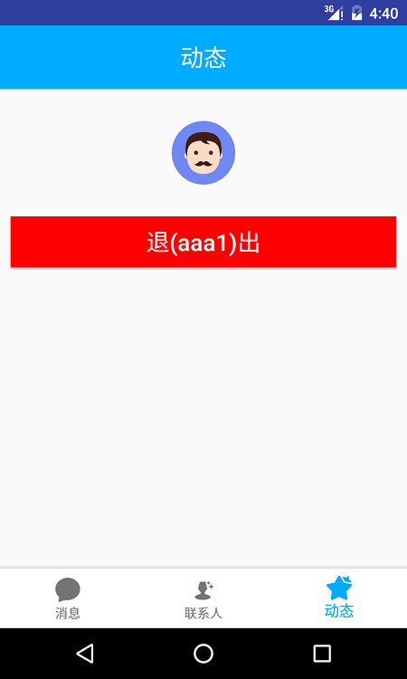

## MVP实现 ##
* DynamicView
* DynamicPresenter

动态界面目前只实现了退出登录功能。

    @Override
    public void logout() {
        mDynamicView.onStartLogout();
        EMClient.getInstance().logout(true, mEMCallBackAdapter);
    }

# 联系人界面 #
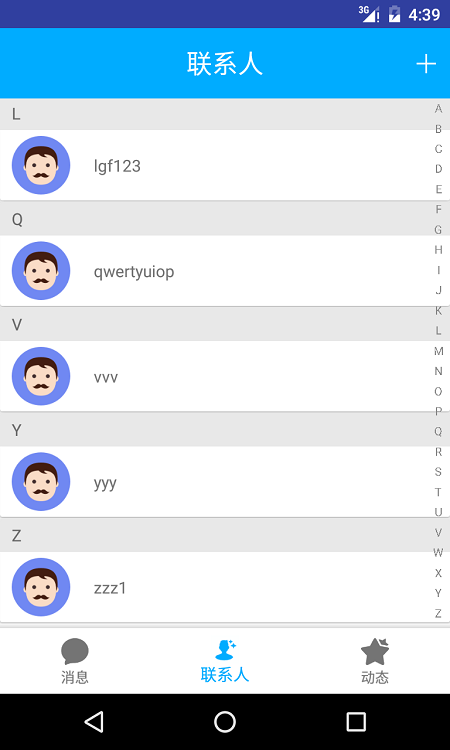
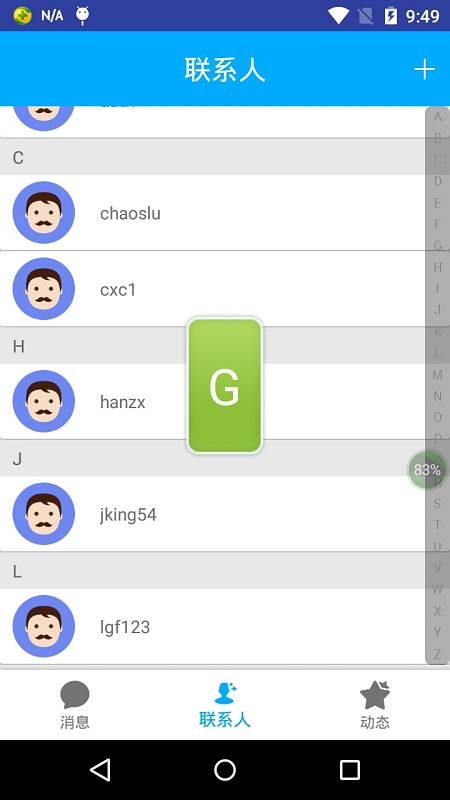

## MVP实现 ##
* ContactView
* ContactPresenter

## 使用RecyclerView实现联系人列表 ##
RecyclerView类似ListView, 但比ListView更高级更灵活。使用RecyclerView必须指定一个适配器和一个布局管理器，
经常有同学忘记设置布局管理器，结果导致RecyclerView什么也没有显示。适配器通常继承自RecyclerView.Adapter。

RecyclerView提供这些内置管理器：

* LinearLayoutManager 线性布局管理器 （类似ListView效果）
* GridLayoutManager 网格布局管理器 （类似GridView效果）
* StaggeredGridLayoutManager 分散网格布局管理器（瀑布流效果）

如果要自定义一个布局管理器，请继承自RecyclerView.LayoutManager。另外，RecyclerView在默认情况下启用增添与删除item的动画，
如果要定义这些动画，请继承RecyclerView.ItemAnimator并使用RecyclerView.setItemAnimator()。

### 初始化 ###
    private void initRecyclerView() {
        mRecyclerView.setLayoutManager(new LinearLayoutManager(getContext()));//设置布局管理器
        mRecyclerView.setHasFixedSize(true);//设置true如果列表内容不会影响RecyclerView的大小
        mContactListAdapter = new ContactListAdapter(getContext(), mContactPresenter.getContactList());
        mContactListAdapter.setOnItemClickListener(mOnItemClickListener);
        mRecyclerView.setAdapter(mContactListAdapter);
    }

### ContactListAdapter的实现  ###

#### ContactListItemView ####

运用模块化的思想，将联系人的列表项抽取成一个独立的自定义组合式控件ContactListItemView。ContactListItemView只需传入一个
与之对应的数据模型ContactListItem即可完成渲染。

#### 联系人是否在同一个组 ####
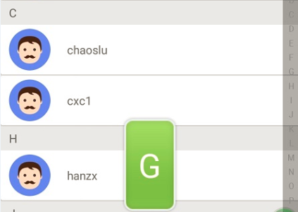

当多个联系人的首字符相同时，只有第一个ContactListItemView显示首字符，后续首字符相同的ContactListItemView均不显示首字符。
在ContactListItem中声明一个布尔型变量showFirstLetter来标记是否显示首字符。该变量在创建ContactListItem时赋值。

    /**
     * 获取联系人列表数据
     * @throws HyphenateException
     */
	private void startGetContactList() throws HyphenateException {
        List<String> contacts = EMClient.getInstance().contactManager().getAllContactsFromServer();
        DatabaseManager.getInstance().deleteAllContacts();
        if (!contacts.isEmpty()) {
            for (int i = 0; i < contacts.size(); i++) {
                ContactListItem item = new ContactListItem();
                item.userName = contacts.get(i);
                if (itemInSameGroup(i, item)) {
                    item.showFirstLetter = false;
                }
                mContactListItems.add(item);
                saveContactToDatabase(item.userName);
            }
        }
    }

	/**
     * 当前联系人跟上个联系人比较，如果首字符相同则返回true
     * @param i 当前联系人下标
     * @param item 当前联系人数据模型
     * @return true 表示当前联系人和上一联系人在同一组
     */
    private boolean itemInSameGroup(int i, ContactListItem item) {
        return i > 0 && (item.getFirstLetter() == mContactListItems.get(i - 1).getFirstLetter());
    }

#### CardView的使用 ####
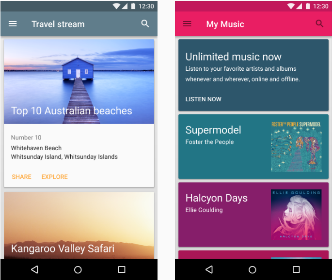

CardView继承自FrameLayout, 是Material Design里面的卡片设计，带有圆角和阴影效果。CardView效果非常好看，但也不能滥用，
比如：

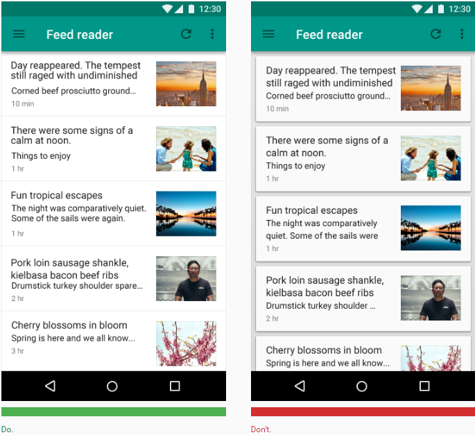

更多的使用规范，请参考Material Design的设计规范[Material Design Cards](https://material.google.com/components/cards.html)。

这里我们给ContactListItemView的布局里面包了一层CardView，实际上是不可取的做法，这里只是为了展示CardView的使用姿势，实际项目中请大家遵循Material Design的设计规范。

### 参考 ###
* [Creating Lists and Cards](https://developer.android.com/training/material/lists-cards.html#RecyclerView)
* [Android RecyclerView 使用完全解析 体验艺术般的控件](http://blog.csdn.net/lmj623565791/article/details/45059587)

## SwipeRefreshLayout的使用 ##
	//设置SwipeRefreshLayout的颜色
	mSwipeRefreshLayout.setColorSchemeResources(R.color.qq_blue, R.color.qq_red);
	//设置SwipeRefreshLayout的监听器
	mSwipeRefreshLayout.setOnRefreshListener(mOnRefreshListener);

## 自定义控件SlideBar ##
### 分类字符数组 ###
    private static final String[] SECTIONS = {"A", "B", "C", "D", "E", "F", "G", "H", "I", "J", "K", "L"
            , "M", "N", "O", "P", "Q", "R", "S", "T", "U", "V", "W", "X", "Y", "Z"};
### 绘制居中文本 ###
[FontMetrics](http://www.cnblogs.com/tianzhijiexian/p/4297664.html)

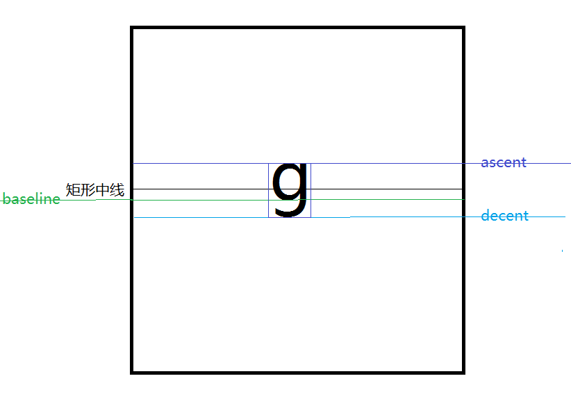

    @Override
    protected void onSizeChanged(int w, int h, int oldw, int oldh) {
        mTextSize = h * 1.0f / SECTIONS.length;//计算分配给字符的高度
        Paint.FontMetrics fontMetrics = mPaint.getFontMetrics();
        float mTextHeight = fontMetrics.descent - fontMetrics.ascent;//获取绘制字符的实际高度
        mTextBaseline = mTextSize / 2 + mTextHeight/2 - fontMetrics.descent;//计算字符居中时的baseline
    }

    @Override
    protected void onDraw(Canvas canvas) {
        float x = getWidth() * 1.0f / 2;
        float baseline = mTextBaseline;
        for(int i = 0; i < SECTIONS.length; i++) {
            canvas.drawText(SECTIONS[i], x, baseline, mPaint);
            baseline += mTextSize;
        }
    }

### 在ContactFragment里面监听SlideBar的事件 ###

当用户在SlideBar上ACTION_DOWN和ACTION_MOVE时，如果用户触摸到的首字符发生变化，则会回调监听器onSectionChange,
当ACTION_UP时回调onSlidingFinish()。

    private SlideBar.OnSlideBarChangeListener mOnSlideBarChangeListener = new SlideBar.OnSlideBarChangeListener() {
        @Override
        public void onSectionChange(int index, String section) {
            mSection.setVisibility(View.VISIBLE);//显示中间绿色背景的首字符
            mSection.setText(section);
            scrollToSection(section);//滚动RecyclerView到用户滑到的首字符
        }

        @Override
        public void onSlidingFinish() {
            mSection.setVisibility(View.GONE);//隐藏中间绿色背景的首字符
        }
    };

## 联系人点击事件 ##
当单击联系人时跳转到聊天界面，当长按联系人时弹出Dialog询问用户是否删除好友。

    private ContactListAdapter.OnItemClickListener mOnItemClickListener = new ContactListAdapter.OnItemClickListener() {

        /**
         * 单击跳转到聊天界面
         * @param name 点击item的联系人名字
         */
        @Override
        public void onItemClick(String name) {
            startActivity(ChatActivity.class, Constant.Extra.USER_NAME, name);
        }

        /**
         * 长按删除好友
         * @param name 点击item的联系人名字
         */
        @Override
        public void onItemLongClick(final String name) {
            showDeleteFriendDialog(name);
        }
    };

# 添加好友界面 #
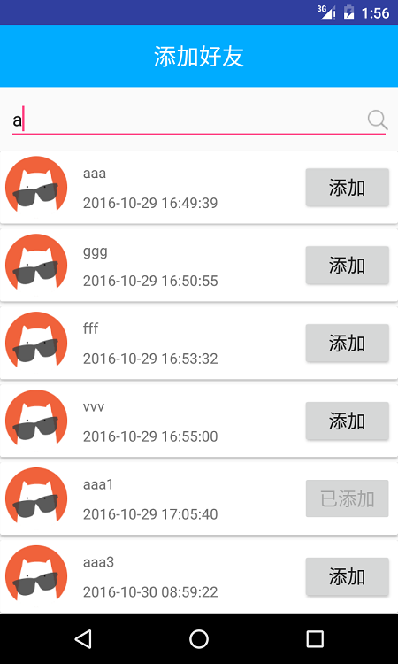

## MVP实现 ##
* AddFriendView
* AddFriendPresenter

## 搜索用户 ##
[Bmob查询数据](http://docs.bmob.cn/data/Android/b_developdoc/doc/index.html#查询数据)

    @Override
    public void searchFriend(final String keyword) {
        mAddFriendView.onStartSearch();
        //注:模糊查询只对付费用户开放，付费后可直接使用。
        BmobQuery<User> query = new BmobQuery<User>();
        query.addWhereContains("username", keyword).addWhereNotEqualTo("username", EMClient.getInstance().getCurrentUser());
        query.findObjects(new FindListener<User>() {
            @Override
            public void done(List<User> list, BmobException e) {
                processResult(list, e);
            }
        });
    }

## greenDAO ##
greenDAO是Android SQLite数据库ORM框架的一种。ORM即对象关系映射, object/relational mapping, 将Java对象映射成数据库的表。
我们需要存储联系人数据到数据库，在添加好友界面，需要判断搜索出来的用户是否已经是联系人，如果已经是好友，则应显示“已添加”。
### 其他ORM框架 ###
* [DBFlow](https://github.com/Raizlabs/DBFlow)
* [Ormlite](http://ormlite.com/)
* [Sugar](http://satyan.github.io/sugar/)
* [ActiveAndroid](https://github.com/pardom/ActiveAndroid)
* [Sprinkles](https://github.com/emilsjolander/sprinkles)
* [Ollie](https://github.com/pardom/ollie/)

### 参考 ###
* [Github](https://github.com/greenrobot/greenDAO)
* [greeDao官网](http://greenrobot.org/greendao/)
* [greeDao使用文档](http://greenrobot.org/greendao/documentation/)
* [greeDao中文使用文档](http://www.jianshu.com/p/2f7f48563141)
* [AppBrain](http://www.appbrain.com/stats/libraries/details/greendao/greendao)

### 创建实体类 ###
	@Entity
	public class Contact {
	
	    @Id
	    public Long id;
	
	    public String userName;
	}

### 初始化 ###
    public void init(Context context) {
        DaoMaster.DevOpenHelper devOpenHelper = new DaoMaster.DevOpenHelper(context, Constant.Database.DATABASE_NAME, null);
        SQLiteDatabase writableDatabase = devOpenHelper.getWritableDatabase();
        DaoMaster daoMaster = new DaoMaster(writableDatabase);
        mDaoSession = daoMaster.newSession();
    }

### 保存联系人 ###
    public void saveContact(String userName) {
        Contact contact = new Contact();
        contact.setUsername(userName);
        mDaoSession.getContactDao().save(contact);
    }

### 查询联系人 ###
    public List<String> queryAllContacts() {
        List<Contact> list = mDaoSession.getContactDao().queryBuilder().list();
        ArrayList<String> contacts = new ArrayList<String>();
        for (int i = 0; i < list.size(); i++) {
            String contact = list.get(i).getUsername();
            contacts.add(contact);
        }
        return contacts;
    }

### 删除所有联系人 ###
    public void deleteAllContacts() {
        ContactDao contactDao = mDaoSession.getContactDao();
        contactDao.deleteAll();
    }

## 发送好友请求 ##
### AddFriendItemView里面处理添加好友的点击事件 ###
    @OnClick(R.id.add)
    public void onClick() {
        String friendName = mUserName.getText().toString().trim();
        String addFriendReason = getContext().getString(R.string.add_friend_reason);
        AddFriendEvent event = new AddFriendEvent(friendName, addFriendReason);//通过EventBus发布添加好友事件
        EventBus.getDefault().post(event);
    }

### AddFriendPresenterImpl实现发送好友请求  ###
    @Subscribe(threadMode = ThreadMode.BACKGROUND)
    public void addFriend(AddFriendEvent event) {
        try {
            EMClient.getInstance().contactManager().addContact(event.getFriendName(), event.getReason());
            ThreadUtils.runOnUiThread(new Runnable() {
                @Override
                public void run() {
                    mAddFriendView.onAddFriendSuccess();
                }
            });
        } catch (HyphenateException e) {
            e.printStackTrace();
            ThreadUtils.runOnUiThread(new Runnable() {
                @Override
                public void run() {
                    mAddFriendView.onAddFriendFailed();
                }
            });
        }

### 在联系人列表中监听联系人变化 ###
当新增好友或者被好友删除时刷新联系人列表。

    private EMContactListenerAdapter mEMContactListener = new EMContactListenerAdapter() {

        @Override
        public void onContactAdded(String s) {
            mContactPresenter.refreshContactList();
        }

        @Override
        public void onContactDeleted(String s) {
            mContactPresenter.refreshContactList();
        }
    };

# 聊天界面 #
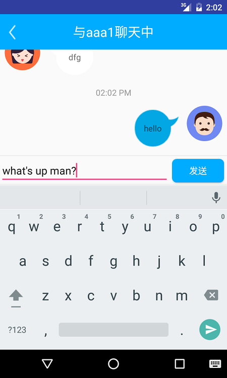

## MVP实现 ##
* ChatView
* ChatPresenter

## UI ##

### 监听发送按钮的状态变化 ###
    mEdit.addTextChangedListener(mTextWatcher);
    private TextWatcherAdapter mTextWatcher = new TextWatcherAdapter() {
        @Override
        public void afterTextChanged(Editable s) {
            mSend.setEnabled(s.length() != 0);
        }
    };

### 动画文件 ###
* anim文件夹：存放补间动画
* animator文件夹：存放属性动画
* drawable文件夹：存放帧动画

### 发送消息的进度动画 ###
	<?xml version="1.0" encoding="utf-8"?>
	<animation-list xmlns:android="http://schemas.android.com/apk/res/android">
	    <item android:drawable="@mipmap/loading1" android:duration="100"/>
	    <item android:drawable="@mipmap/loading2" android:duration="100"/>
	    <item android:drawable="@mipmap/loading3" android:duration="100"/>
	    <item android:drawable="@mipmap/loading4" android:duration="100"/>
	    <item android:drawable="@mipmap/loading5" android:duration="100"/>
	    <item android:drawable="@mipmap/loading6" android:duration="100"/>
	    <item android:drawable="@mipmap/loading7" android:duration="100"/>
	    <item android:drawable="@mipmap/loading8" android:duration="100"/>
	</animation-list>

### .9文件制作 ###
[官方说明](https://developer.android.com/guide/topics/graphics/2d-graphics.html#nine-patch)

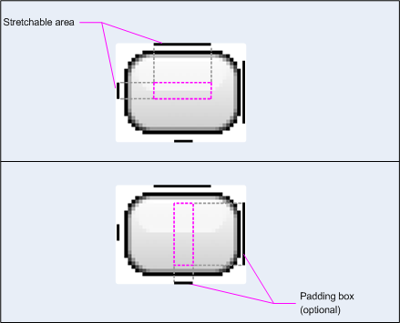

## 发送一条消息 ##

### 返回消息的类型 ###
根据是发送的消息还是接受的消息，来创建不同的item。

    @Override
    public int getItemViewType(int position) {
        EMMessage message = mMessages.get(position);
        return message.direct() == EMMessage.Direct.SEND ? ITEM_TYPE_SEND_MESSAGE : ITEM_TYPE_RECEIVE_MESSAGE;
    }

### 是否显示时间戳的判断 ###
    /**
     * 如果两个消息之间的时间太近，就不显示时间戳
     */
    private boolean shouldShowTimeStamp(int position) {
        long currentItemTimestamp = mMessages.get(position).getMsgTime();
        long preItemTimestamp = mMessages.get(position - 1).getMsgTime();
        boolean closeEnough = DateUtils.isCloseEnough(currentItemTimestamp, preItemTimestamp);
        return !closeEnough;
    }

### 更新消息的状态 ###
处理三种消息状态，正在发送中INPROGRESS，发送成功SUCCESS，发送失败FAIL。

    private void updateSendingStatus(EMMessage emMessage) {
        switch (emMessage.status()) {
            case INPROGRESS:
                mSendMessageProgress.setVisibility(VISIBLE);
                mSendMessageProgress.setImageResource(R.drawable.send_message_progress);
                AnimationDrawable drawable = (AnimationDrawable) mSendMessageProgress.getDrawable();
                drawable.start();
                break;
            case SUCCESS:
                mSendMessageProgress.setVisibility(GONE);
                break;
            case FAIL:
                mSendMessageProgress.setImageResource(R.mipmap.msg_error);
                break;
        }
    }

## 接收一条消息 ##
监听消息的接收，当收到一条消息后，通知MessageListAdapter进行刷新，并且滚动RecyclerView到底部。

    private EMMessageListenerAdapter mEMMessageListener = new EMMessageListenerAdapter() {
        @Override
        public void onMessageReceived(final List<EMMessage> list) {
            ThreadUtils.runOnUiThread(new Runnable() {
                @Override
                public void run() {
                    final EMMessage emMessage = list.get(0);
                    mChatPresenter.makeMessageRead(mUserName);
                    mMessageListAdapter.addNewMessage(emMessage);
                    smoothScrollToBottom();
                }
            });
        }
    };

## 初始化聊天记录 ##
[环信官方文档](http://docs.easemob.com/im/200androidclientintegration/50singlechat)

[通信过程及聊天记录保存](http://docs.easemob.com/im/000quickstart/25communicationandmessagestorage)

    @Override
    public void loadMessages(final String userName) {
        ThreadUtils.runOnBackgroundThread(new Runnable() {
            @Override
            public void run() {
                EMConversation conversation = EMClient.getInstance().chatManager().getConversation(userName);
                if (conversation != null) {
                    //获取此会话的所有消息
                    List<EMMessage> messages = conversation.getAllMessages();
                    mEMMessageList.addAll(messages);
                    //指定会话消息未读数清零
                    conversation.markAllMessagesAsRead();
                }
                ThreadUtils.runOnUiThread(new Runnable() {
                    @Override
                    public void run() {
                        mChatView.onMessagesLoaded();
                    }
                });
            }
        });
    }

## 加载更多聊天记录 ##
    @Override
    public void loadMoreMessages(final String userName) {
        if (hasMoreData) {
            ThreadUtils.runOnBackgroundThread(new Runnable() {
                @Override
                public void run() {
                    EMConversation conversation = EMClient.getInstance().chatManager().getConversation(userName);
                    EMMessage firstMessage = mEMMessageList.get(0);
                    //SDK初始化加载的聊天记录为20条，到顶时需要去DB里获取更多
                    //获取startMsgId之前的pagesize条消息，此方法获取的messages SDK会自动存入到此会话中，APP中无需再次把获取到的messages添加到会话中
                    final List<EMMessage> messages = conversation.loadMoreMsgFromDB(firstMessage.getMsgId(), DEFAULT_PAGE_SIZE);
                    hasMoreData = (messages.size() == DEFAULT_PAGE_SIZE);
                    mEMMessageList.addAll(0, messages);
                    ThreadUtils.runOnUiThread(new Runnable() {
                        @Override
                        public void run() {
                            mChatView.onMoreMessagesLoaded(messages.size());
                        }
                    });
                }
            });
        } else {
            mChatView.onNoMoreData();
        }
    }

# 会话界面 #

## MVP实现 ##
* ConversationView
* ConversationPresenter

## 加载所有会话 ##

    @Override
    public void loadAllConversations() {
        ThreadUtils.runOnBackgroundThread(new Runnable() {
            @Override
            public void run() {
                Map<String, EMConversation> conversations = EMClient.getInstance().chatManager().getAllConversations();
                mEMConversations.addAll(conversations.values());
				//根据最后一条消息的时间进行排序
                Collections.sort(mEMConversations, new Comparator<EMConversation>() {
                    @Override
                    public int compare(EMConversation o1, EMConversation o2) {
                        return (int) (o2.getLastMessage().getMsgTime() - o1.getLastMessage().getMsgTime());
                    }
                });
                ThreadUtils.runOnUiThread(new Runnable() {
                    @Override
                    public void run() {
                        mConversationView.onAllConversationsLoaded();
                    }
                });
            }
        });
    }

## 未读消息计数更新 ##
[环信官方文档](http://docs.easemob.com/im/200androidclientintegration/50singlechat)
### 会话列表中未读消息的更新 ###
    private EMMessageListenerAdapter mEMMessageListenerAdapter = new EMMessageListenerAdapter() {

        @Override
        public void onMessageReceived(List<EMMessage> list) {
            ThreadUtils.runOnUiThread(new Runnable() {
                @Override
                public void run() {
                    toast(getString(R.string.receive_new_message));
					//当收到一个新消息时，重新加载会话列表。
                    mConversationPresenter.loadAllConversations();
                }
            });
        }
    };
### BottomBar badge的更新 ###
    private EMMessageListenerAdapter mEMMessageListenerAdapter = new EMMessageListenerAdapter() {

        //该回调在子线程中调用
        @Override
        public void onMessageReceived(List<EMMessage> list) {
            updateUnreadCount();
        }
    };

    private void updateUnreadCount() {
        ThreadUtils.runOnUiThread(new Runnable() {
            @Override
            public void run() {
                BottomBarTab bottomBar = mBottomBar.getTabWithId(R.id.conversations);
                int count = EMClient.getInstance().chatManager().getUnreadMsgsCount();
                bottomBar.setBadgeCount(count);
            }
        });
    }

## 标记消息已读 ##
### 加载聊天数据时标记已读 ###
	//指定会话消息未读数清零
	conversation.markAllMessagesAsRead();
### 在聊天界面收到新消息时将消息标记已读 ###
    private EMMessageListenerAdapter mEMMessageListener = new EMMessageListenerAdapter() {
        @Override
        public void onMessageReceived(final List<EMMessage> list) {
            ThreadUtils.runOnUiThread(new Runnable() {
                @Override
                public void run() {
                    final EMMessage emMessage = list.get(0);
                    if (emMessage.getUserName().equals(mUserName)) {
						//标记消息已读
                        mChatPresenter.makeMessageRead(mUserName);
                        mMessageListAdapter.addNewMessage(emMessage);
                        smoothScrollToBottom();
                    }
                }
            });
        }
    };

### 聊天界面返回时更新未读badge ###
    @Override
    protected void onResume() {
        super.onResume();
        updateUnreadCount();
    }

# 消息通知 #
## 通知 ##
### 判断app是否在前台 ###
    public boolean isForeground() {
        ActivityManager am = (ActivityManager) getSystemService(ACTIVITY_SERVICE);
        List<ActivityManager.RunningAppProcessInfo> runningAppProcesses = am.getRunningAppProcesses();
        if (runningAppProcesses == null) {
            return false;
        }
        for (ActivityManager.RunningAppProcessInfo info :runningAppProcesses) {
            if (info.processName.equals(getPackageName()) && info.importance == ActivityManager.RunningAppProcessInfo.IMPORTANCE_FOREGROUND) {
                return true;
            }
        }
        return false;
    }

### 如果app在后台则弹出Notification ###
    private void showNotification(EMMessage emMessage) {
        String contentText = "";
        if (emMessage.getBody() instanceof EMTextMessageBody) {
            contentText = ((EMTextMessageBody) emMessage.getBody()).getMessage();
        }

        Intent chat = new Intent(this, ChatActivity.class);
        chat.putExtra(Constant.Extra.USER_NAME, emMessage.getUserName());
        PendingIntent pendingIntent = PendingIntent.getActivity(this, 1, chat, PendingIntent.FLAG_UPDATE_CURRENT);

        NotificationManager notificationManager = (NotificationManager) getSystemService(NOTIFICATION_SERVICE);
        Notification notification = new Notification.Builder(this)
                .setLargeIcon(BitmapFactory.decodeResource(getResources(), R.mipmap.avatar1))
                .setSmallIcon(R.mipmap.ic_contact_selected_2)
                .setContentTitle(getString(R.string.receive_new_message))
                .setContentText(contentText)
                .setPriority(Notification.PRIORITY_MAX)
                .setContentIntent(pendingIntent)
                .setAutoCancel(true)
                .build();
        notificationManager.notify(1, notification);
    }

## 声音  ##

### 初始化SoundPool ###
    private void initSoundPool() {
        mSoundPool = new SoundPool(2, AudioManager.STREAM_MUSIC, 0);
        mDuanSound = mSoundPool.load(this, R.raw.duan, 1);
        mYuluSound = mSoundPool.load(this, R.raw.yulu, 1);
    }

### 播放音效 ###
    private EMMessageListenerAdapter mEMMessageListenerAdapter = new EMMessageListenerAdapter() {

        @Override
        public void onMessageReceived(List<EMMessage> list) {
            if (isForeground()) {
                mSoundPool.play(mDuanSound, 1, 1, 0, 0, 1);
            } else {
                mSoundPool.play(mYuluSound, 1, 1, 0, 0, 1);
                showNotification(list.get(0));
            }
        }
    };

# 多设备登录 #
[环信官方文档](http://docs.easemob.com/im/200androidclientintegration/30androidsdkbasics)

    private EMConnectionListener mEMConnectionListener = new EMConnectionListener() {
        @Override
        public void onConnected() {

        }

        @Override
        public void onDisconnected(int i) {
            if (i == EMError.USER_LOGIN_ANOTHER_DEVICE) {
                ThreadUtils.runOnUiThread(new Runnable() {
                    @Override
                    public void run() {
                        startActivity(LoginActivity.class);
                        toast(getString(R.string.user_login_another_device));
                    }
                });
            }
        }
    };

# License #

	QQDemo
	Copyright (c) 2016 Leon Fan (https://github.com/uncleleonfan).
	
	Licensed under the Apache License, Version 2.0 (the "License");
	you may not use this file except in compliance with the License.
	You may obtain a copy of the License at
	
	http://www.apache.org/licenses/LICENSE-2.0
	
	Unless required by applicable law or agreed to in writing, software
	distributed under the License is distributed on an "AS IS" BASIS,
	WITHOUT WARRANTIES OR CONDITIONS OF ANY KIND, either express or implied.
	See the License for the specific language governing permissions and
	limitations under the License.