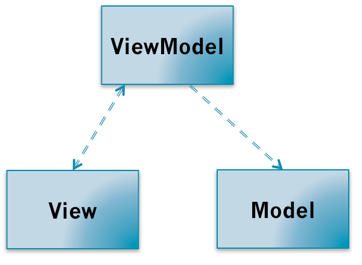
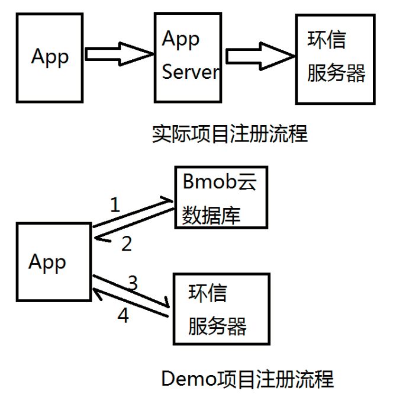

# 项目简介 #
本项目是即时通讯的示例项目，使用了MVP模式，集成了环信SDK和Bmob后端云，展示了即时通讯基本的功能的实现，包括注册登录，退出登录，联系人列表，添加好友，删除好友，收发消息，消息提醒等功能。
## 使用的开源项目 ##
* [BottomBar](https://github.com/roughike/BottomBar)
* [EventBus](https://github.com/greenrobot/EventBus)
* [greenDAO](https://github.com/greenrobot/greenDAO)
* [butterknife](https://github.com/JakeWharton/butterknife)

## 学习目标 ##
* 环信SDK的集成与使用
* MVP模式的运用
* ORM数据库的集成与使用
* 模块化思想的运用

# 即时通讯 IM(Instant Messaging)#
>允许两人或多人使用网路即时的传递文字讯息、档案、语音与视频交流。

## 相关产品 ##
* 鼻祖 ICQ
* 国内主流 QQ 微信 陌陌 YY等
* 国外主流 Facebook Messenger WhatsApp Skype Instagram Line

## 第三方服务平台 ##
* [环信](http://www.easemob.com/product/cs?utm_source=baidu-pp)
* [融云](http://www.rongcloud.cn/)
* [网易云信](http://netease.im/)
* [极光IM](https://www.jiguang.cn/im)
* [腾讯云通信IM](https://www.qcloud.com/product/im.html)
* [爱萌](http://www.imsdk.im/)
* [阿里悟空(2016年10月31号正式下线)](http://www.imwukong.com/)
* [阿里百川云旺](http://im.taobao.com/)

# 环信 #
[官网](http://www.easemob.com/product/cs?utm_source=baidu-pp)

[即时通信云3.x文档](http://docs.easemob.com/im/start)

## 环信集成 ##
1. [注册并创建应用](http://docs.easemob.com/im/000quickstart/10register)
2. [下载SDK](http://www.easemob.com/download/im)
3. [SDK的导入](http://docs.easemob.com/im/200androidclientintegration/10androidsdkimport)
4. [SDK的初始化](http://docs.easemob.com/im/200androidclientintegration/30androidsdkbasics)

### .so文件夹 ###
1. 放在jniLibs
2. 也可以放在libs目录下，不过需要在模块下的配置文件中配置
	
		android {
			sourceSets {
		        main {
		            jniLibs.srcDirs = ['libs']
		        }
		    }
		}

### 巨坑 ###
运行出错：Didn't find class "com.hyphenate.chat.adapter.EMACallSession"，原因是hyphenatechat_3.2.0.jar包内没有该类。

解决办法:导入Demo源码中EaseUI库里面的hyphenatechat_3.2.0.jar替换。

# 软件架构 #

## MVC ##

MVC应用于Ruby on Rails, Spring Framework, iOS开发和 ASP.NET等。

* Model: 获取数据的业务逻辑，网络操作，数据库操作
* View: UI
* Controller: 操作Model层获取数据传递给UI

### 服务器端的MVC ###

### Android中MVC ###
Android中并没有清晰的MVC框架，如果把Activity当做Controller,根据我们实际开发经验，里面会有大量的UI操作，所以V和C就傻傻分不清了。

* Model:Java Bean, NetworkManager, DataBaseHelper
* View: xml res
* Controller: Activity Fragment
* ArrayList-ListView-Adapter(MVC)

## MVP ##
MVP主要应用于ASP.NET等。**MVP与MVC主要区别是View和Model不再耦合。**

* Model: 获取数据的业务逻辑，网络操作，数据库操作
* View: UI
* Presenter: 操作Model层获取数据传递给UI

## MVVM ##
MVVM主要应用于WPF, Silverlight, Caliburn, nRoute等。

* Model: 获取数据的业务逻辑，网络操作，数据库操作
* View: UI
* ViewModel: 将View和Model绑定

### Android中MVVM ###
[Data Binding Library](https://developer.android.com/topic/libraries/data-binding/index.html)
[中文翻译](http://www.jianshu.com/p/b1df61a4df77)

## 软件架构的核心思想 ##
>分层分模块

## 参考 ##
[android architecture](https://github.com/googlesamples/android-architecture)

[MVC,MVP和MVVM模式如何选择](http://www.jianshu.com/p/6a86f7fdc0cb)

[Understanding MVC, MVP and MVVM Design Patterns](http://www.dotnettricks.com/learn/designpatterns/understanding-mvc-mvp-and-mvvm-design-patterns)

[教你认清MVC，MVP和MVVM](http://zjutkz.net/2016/04/13/%E9%80%89%E6%8B%A9%E6%81%90%E6%83%A7%E7%97%87%E7%9A%84%E7%A6%8F%E9%9F%B3%EF%BC%81%E6%95%99%E4%BD%A0%E8%AE%A4%E6%B8%85MVC%EF%BC%8CMVP%E5%92%8CMVVM/)

[Android Data Binding](https://github.com/LyndonChin/MasteringAndroidDataBinding)

[Clean Architecture](http://fernandocejas.com/2014/09/03/architecting-android-the-clean-way/)

# 准备好了么？ 开车啦！！！ #
## 包的创建 ##
* adapter 存放适配器
* app 存放常量类，Application类以及一些app层级的全局类
* database 数据库相关类
* event EventBus使用的事件类
* factory 工厂类
* model 数据模型
* presenter MVP模型中的Presenter类
* ui 存放activity和fragment
* utils 工具类
* view MVP模型中的View类
* widget 自定义控件

## 基类的创建 ##
* BaseActivity
* BaseFragment

## Git初始化 ##

# Splash界面 #

## 功能需求 ##
1. 如果没有登录，延时2s, 跳转到登录界面
2. 如果已经登录，则跳转到主界面

## MVP实现 ##
* SplashView
* SplashPresenter

# 登录界面 #

## 功能需求 ##
1. 有两种情况都可以发起登录操作，一是点击登录按钮，而是点击虚拟键盘上的Action键。
2. 点击新用户，跳转到注册界面。

## IME Options##
**注意配置EditText的imeOptions属性时，需要配合inputType才能起作用。**

	android:imeOptions="actionNext"//下一个
	android:imeOptions="actionGo"//启动
	android:imeOptions="actionDone"//完成
	android:imeOptions="actionPrevious"//上一个
	android:imeOptions="actionSearch"//搜索
	android:imeOptions="actionSend"//发送
	
## MVP实现 ##
* LoginView
* LoginPresenter

## EMCallBack的适配器 ##

	public class EMCallBackAdapter implements EMCallBack{
	
	    @Override
	    public void onSuccess() {
	
	    }
	
	    @Override
	    public void onError(int i, String s) {
	
	    }
	
	    @Override
	    public void onProgress(int i, String s) {
	
	    }
	}

## Android6.0动态权限管理 ##
[介绍](http://www.jianshu.com/p/a37f4827079a)

举个栗子：高德地图 百度地图等

    /**
     * 是否有写磁盘权限
     */
    private boolean hasWriteExternalStoragePermission() {
        int result = ActivityCompat.checkSelfPermission(this, Manifest.permission.WRITE_EXTERNAL_STORAGE);
        return result == PermissionChecker.PERMISSION_GRANTED;
    }

    /**
     * 申请权限
     */
    private void applyPermission() {
        String[] permissions = {Manifest.permission.WRITE_EXTERNAL_STORAGE};
        ActivityCompat.requestPermissions(this, permissions, REQUEST_WRITE_EXTERNAL_STORAGE);
    }

    /**
     * 申请权限回调
     */
    @Override
    public void onRequestPermissionsResult(int requestCode, @NonNull String[] permissions, @NonNull int[] grantResults) {
        switch (requestCode) {
            case REQUEST_WRITE_EXTERNAL_STORAGE:
                if (grantResults[0] == PermissionChecker.PERMISSION_GRANTED) {
                    login();
                } else {
                    toast(getString(R.string.not_get_permission));
                }
                break;
        }
    }

# 注册界面 #

## 功能需求 ##
1. 用户名的长度必须是3-20位，首字母必须为英文字符，其他字符则除了英文外还可以是数字或者下划线。
2. 密码必须是3-20位的数字。
3. 密码和确认密码一致

## 正则表达式 ##
[正则表达式-元字符](http://www.runoob.com/regexp/regexp-metachar.html)

	private static final String USER_NAME_REGEX = "^[a-zA-Z]\\w{2,19}$";
    private static final String PASSWORD_REGEX = "^[0-9]{3,20}$";

* \w 匹配包括下划线的任何单词字符。等价于'[A-Za-z0-9_]'。

## MVP实现 ##
* RegisterView
* RegisterPresenter

## 注册流程 ##
1. 实际项目中，注册会将用户名和密码注册到APP的服务器，然后APP的服务器再通过REST API方式注册到环信服务器。
2. 由于本项目没有APP服务器，会将用户数据注册到第三方云数据库Bmob，注册成功后，在客户端发送请求注册到环信服务器。

## 云数据库 ##
* [LeanCloud](https://leancloud.cn/)
* [Bmob](http://www.bmob.cn/)
* [Parse](https://parse.com/)(2017年1月28日关闭)

## Bmob集成 ##
[开发文档](http://docs.bmob.cn/data/Android/b_developdoc/doc/index.html)

1. 注册创建应用
2. 下载SDK
3. 导入SDK
4. 初始化SDk

## 隐藏软键盘 ##

	protected void hideSoftKeyboard() {
        if (mInputMethodManager == null) {
            mInputMethodManager = (InputMethodManager) getSystemService(INPUT_METHOD_SERVICE);
        }
        mInputMethodManager.hideSoftInputFromWindow(getCurrentFocus().getWindowToken(), 0);
    }

## 软键盘Action处理 ##

    private TextView.OnEditorActionListener mOnEditorActionListener = new TextView.OnEditorActionListener() {
        @Override
        public boolean onEditorAction(TextView v, int actionId, KeyEvent event) {
            if (actionId == EditorInfo.IME_ACTION_GO) {
                reigister();//注册
                return true;
            }
            return false;
        }
    };

## 用户名已注册的处理 ##
[Bmob错误码](http://docs.bmob.cn/data/Android/g_errorcode/doc/index.html)

# 主界面 #

## 底部导航条 ##
RadioGroup, TabHost, FragmentTabHost, 自定义
## 第三方底部条 ##
[BottomBar](https://github.com/roughike/BottomBar)
[AHBottomNavigation](https://github.com/aurelhubert/ahbottomnavigation)
[BottomNavigation](https://github.com/Ashok-Varma/BottomNavigation)
## Fragment的切换 ##

# 动态界面 #

# 联系人界面 #

# MVP实现 #
* ContactView
* ContactPresenter

## RecyclerView的使用 ##
[Creating Lists and Cards](https://developer.android.com/training/material/lists-cards.html#RecyclerView)

## 联系人是否在同一个组 ##

    private boolean itemInSameGroup(int i, ContactItem item) {
        return i > 0 && (item.getFirstLetter() == mContactItems.get(i - 1).getFirstLetter());
    }

## CardView的使用 ##

## SwipeRefreshLayout的使用 ##
	mSwipeRefreshLayout.setColorSchemeResources(R.color.qq_blue, R.color.qq_red);
	mSwipeRefreshLayout.setOnRefreshListener(mOnRefreshListener);

## 自定义控件SlideBar ##
### 分类字符数组（供拷贝） ###
    private static final String[] SECTIONS = {"A", "B", "C", "D", "E", "F", "G", "H", "I", "J", "K", "L"
            , "M", "N", "O", "P", "Q", "R", "S", "T", "U", "V", "W", "X", "Y", "Z"};
### 绘制居中文本 ###
http://www.cnblogs.com/tianzhijiexian/p/4297664.html

### 在ContactFragment里面监听SlideBar的事件 ###
    private SlideBar.OnSlideBarChangeListener mOnSlideBarChangeListener = new SlideBar.OnSlideBarChangeListener() {
        @Override
        public void onSectionChange(int index, String section) {
            mSection.setVisibility(View.VISIBLE);
            mSection.setText(section);
            scrollToSection(section);
        }

        @Override
        public void onSlidingFinish() {
            mSection.setVisibility(View.GONE);
        }
    };

    /**
     * RecyclerView滚动直到界面出现对应section的联系人
     * 
     * @param section 首字符
     */
    private void scrollToSection(String section) {
        int sectionPosition = getSectionPosition(section);
        if (sectionPosition != POSITION_NOT_FOUND) {
            mRecyclerView.smoothScrollToPosition(sectionPosition);
        }
    }

    /**
     * 
     * @param section 首字符
     * @return 在联系人列表中首字符是section的第一个联系人在联系人列表中的位置
     */
    private int getSectionPosition(String section) {
        List<ContactItem> contactItems = mContactListAdapter.getContactItems();
        for (int i = 0; i < contactItems.size(); i++) {
            if (section.equals(contactItems.get(i).getFirstLetterString())) {
                return i;
            }
        }
        return POSITION_NOT_FOUND;
    }

## 联系人点击事件 ##
    private ContactListAdapter.OnItemClickListener mOnItemClickListener = new ContactListAdapter.OnItemClickListener() {

        /**
         * 单击跳转到聊天界面
         * @param name 点击item的联系人名字
         */
        @Override
        public void onItemClick(String name) {
            startActivity(ChatActivity.class, Constant.Extra.USER_NAME, name);
        }

        /**
         * 长按删除好友
         * @param name 点击item的联系人名字
         */
        @Override
        public void onItemLongClick(final String name) {
            AlertDialog.Builder builder = new AlertDialog.Builder(getContext());
            String message = String.format(getString(R.string.delete_friend_message), name);
            builder.setTitle(getString(R.string.delete_friend))
                    .setMessage(message)
                    .setNegativeButton(getString(R.string.cancel), new DialogInterface.OnClickListener() {
                        @Override
                        public void onClick(DialogInterface dialog, int which) {
                            dialog.dismiss();
                        }
                    })
                    .setPositiveButton(getString(R.string.confirm), new DialogInterface.OnClickListener() {
                        @Override
                        public void onClick(DialogInterface dialog, int which) {
                            dialog.dismiss();
                            showProgress(getString(R.string.deleting_friend));
                            mContactPresenter.deleteFriend(name);

                        }
                    });
            builder.show();
        }
    };

# 添加好友界面 #

## 搜索用户 ##

    @Override
    public void searchFriend(final String keyword) {
        mAddFriendView.onStartSearch();
        //注:模糊查询只对付费用户开放，付费后可直接使用。
        BmobQuery<User> query = new BmobQuery<User>();
        query.addWhereContains("username", keyword).addWhereNotEqualTo("username", EMClient.getInstance().getCurrentUser());
        query.findObjects(new FindListener<User>() {
            @Override
            public void done(List<User> list, BmobException e) {
                processResult(list, e);
            }
        });
    }

## greenDAO ##
greenDAO是Android SQLite数据库ORM框架的一种。ORM即对象关系映射, object/relational mapping, 将Java对象映射成数据库的表。

### 其他ORM框架 ###
* [DBFlow](https://github.com/Raizlabs/DBFlow)
* [Ormlite](http://ormlite.com/)
* [Sugar](http://satyan.github.io/sugar/)
* [ActiveAndroid](https://github.com/pardom/ActiveAndroid)
* [Sprinkles](https://github.com/emilsjolander/sprinkles)
* [Ollie](https://github.com/pardom/ollie/)

### 参考 ###
* [Github](https://github.com/greenrobot/greenDAO)
* [官网](http://greenrobot.org/greendao/)
* [AppBrain](http://www.appbrain.com/stats/libraries/details/greendao/greendao)
* [使用文档](http://greenrobot.org/greendao/documentation/)
* [中文使用文档](http://www.jianshu.com/p/2f7f48563141)

### 初始化 ###
    public void init(Context context) {
        DaoMaster.DevOpenHelper devOpenHelper = new DaoMaster.DevOpenHelper(context, Constant.Database.DATABASE_NAME, null);
        SQLiteDatabase writableDatabase = devOpenHelper.getWritableDatabase();
        DaoMaster daoMaster = new DaoMaster(writableDatabase);
        mDaoSession = daoMaster.newSession();
    }

### 保存联系人 ###
    public void saveContact(String userName) {
        Contact contact = new Contact();
        contact.setUsername(userName);
        mDaoSession.getContactDao().save(contact);
    }

### 查询联系人 ###
    public List<String> queryAllContacts() {
        List<Contact> list = mDaoSession.getContactDao().queryBuilder().list();
        ArrayList<String> contacts = new ArrayList<String>();
        for (int i = 0; i < list.size(); i++) {
            String contact = list.get(i).getUsername();
            contacts.add(contact);
        }
        return contacts;
    }

### 删除联系人 ###
    public void deleteAllContacts() {
        ContactDao contactDao = mDaoSession.getContactDao();
        contactDao.deleteAll();
    }

## 发送好友请求 ##
### AddFriendItemView里面处理点击事件 ###
    @OnClick(R.id.add)
    public void onClick() {
        String friendName = mUserName.getText().toString().trim();
        String addFriendReason = getContext().getString(R.string.add_friend_reason);
        AddFriendEvent event = new AddFriendEvent(friendName, addFriendReason);
        EventBus.getDefault().post(event);
    }

### AddFriendPresenterImpl实现发送好友请求  ###
    @Subscribe(threadMode = ThreadMode.BACKGROUND)
    public void addFriend(AddFriendEvent event) {
        try {
            EMClient.getInstance().contactManager().addContact(event.getFriendName(), event.getReason());
            ThreadUtils.runOnUiThread(new Runnable() {
                @Override
                public void run() {
                    mAddFriendView.onAddFriendSuccess();
                }
            });
        } catch (HyphenateException e) {
            e.printStackTrace();
            ThreadUtils.runOnUiThread(new Runnable() {
                @Override
                public void run() {
                    mAddFriendView.onAddFriendFailed();
                }
            });
        }

### 在联系人列表中监听联系人变化 ###
    private EMContactListenerAdapter mEMContactListener = new EMContactListenerAdapter() {

        @Override
        public void onContactAdded(String s) {
            mContactPresenter.refreshContactList();
        }

        @Override
        public void onContactDeleted(String s) {
            mContactPresenter.refreshContactList();
        }
    };

# 聊天界面 #

### 监听发送按钮的状态变化 ###
    private TextWatcherAdapter mTextWatcher = new TextWatcherAdapter() {
        @Override
        public void afterTextChanged(Editable s) {
            mSend.setEnabled(s.length() != 0);
        }
    };

### 动画文件 ###
* anim文件夹：存放补间动画
* animator文件夹：存放属性动画
* drawable文件夹：存放帧动画
### 发送消息的进度动画 ###
	<?xml version="1.0" encoding="utf-8"?>
	<animation-list xmlns:android="http://schemas.android.com/apk/res/android">
	    <item android:drawable="@mipmap/loading1" android:duration="100"/>
	    <item android:drawable="@mipmap/loading2" android:duration="100"/>
	    <item android:drawable="@mipmap/loading3" android:duration="100"/>
	    <item android:drawable="@mipmap/loading4" android:duration="100"/>
	    <item android:drawable="@mipmap/loading5" android:duration="100"/>
	    <item android:drawable="@mipmap/loading6" android:duration="100"/>
	    <item android:drawable="@mipmap/loading7" android:duration="100"/>
	    <item android:drawable="@mipmap/loading8" android:duration="100"/>
	</animation-list>

### .9文件制作 ###

## 发送一条消息 ##

### 返回消息的类型 ###
    @Override
    public int getItemViewType(int position) {
        EMMessage message = mMessages.get(position);
        return message.direct() == EMMessage.Direct.SEND ? ITEM_TYPE_SEND_MESSAGE : ITEM_TYPE_RECEIVE_MESSAGE;
    }

### 是否显示时间戳的判断 ###
    /**
     * 如果两个消息之间的时间太近，就不显示时间戳
     */
    private boolean shouldShowTimeStamp(int position) {
        long currentItemTimestamp = mMessages.get(position).getMsgTime();
        long preItemTimestamp = mMessages.get(position - 1).getMsgTime();
        boolean closeEnough = DateUtils.isCloseEnough(currentItemTimestamp, preItemTimestamp);
        return !closeEnough;
    }

### 更新消息的状态 ###
    private void updateSendingStatus(EMMessage emMessage) {
        switch (emMessage.status()) {
            case INPROGRESS:
                mSendMessageProgress.setVisibility(VISIBLE);
                mSendMessageProgress.setImageResource(R.drawable.send_message_progress);
                AnimationDrawable drawable = (AnimationDrawable) mSendMessageProgress.getDrawable();
                drawable.start();
                break;
            case SUCCESS:
                mSendMessageProgress.setVisibility(GONE);
                break;
            case FAIL:
                mSendMessageProgress.setImageResource(R.mipmap.msg_error);
                break;
        }
    }

## 接收一条消息 ##
    private EMMessageListenerAdapter mEMMessageListener = new EMMessageListenerAdapter() {
        @Override
        public void onMessageReceived(final List<EMMessage> list) {
            ThreadUtils.runOnUiThread(new Runnable() {
                @Override
                public void run() {
                    final EMMessage emMessage = list.get(0);
                    mChatPresenter.makeMessageRead(mUserName);
                    mMessageListAdapter.addNewMessage(emMessage);
                    smoothScrollToBottom();
                }
            });
        }
    };

## 初始化聊天记录 ##
[官方文档](http://docs.easemob.com/im/200androidclientintegration/50singlechat)

[通信过程及聊天记录保存](http://docs.easemob.com/im/000quickstart/25communicationandmessagestorage)

    @Override
    public void loadMessages(final String userName) {
        ThreadUtils.runOnBackgroundThread(new Runnable() {
            @Override
            public void run() {
                EMConversation conversation = EMClient.getInstance().chatManager().getConversation(userName);
                if (conversation != null) {
                    //获取此会话的所有消息
                    List<EMMessage> messages = conversation.getAllMessages();
                    mEMMessageList.addAll(messages);
                    //指定会话消息未读数清零
                    conversation.markAllMessagesAsRead();
                }
                ThreadUtils.runOnUiThread(new Runnable() {
                    @Override
                    public void run() {
                        mChatView.onMessagesLoaded();
                    }
                });
            }
        });
    }

## 加载更多聊天记录 ##
    @Override
    public void loadMoreMessages(final String userName) {
        if (hasMoreData) {
            ThreadUtils.runOnBackgroundThread(new Runnable() {
                @Override
                public void run() {
                    EMConversation conversation = EMClient.getInstance().chatManager().getConversation(userName);
                    EMMessage firstMessage = mEMMessageList.get(0);
                    //SDK初始化加载的聊天记录为20条，到顶时需要去DB里获取更多
                    //获取startMsgId之前的pagesize条消息，此方法获取的messages SDK会自动存入到此会话中，APP中无需再次把获取到的messages添加到会话中
                    final List<EMMessage> messages = conversation.loadMoreMsgFromDB(firstMessage.getMsgId(), DEFAULT_PAGE_SIZE);
                    hasMoreData = (messages.size() == DEFAULT_PAGE_SIZE);
                    mEMMessageList.addAll(0, messages);
                    ThreadUtils.runOnUiThread(new Runnable() {
                        @Override
                        public void run() {
                            mChatView.onMoreMessagesLoaded(messages.size());
                        }
                    });
                }
            });
        } else {
            mChatView.onNoMoreData();
        }
    }

# 会话界面 #

## 会话界面的MVP实现 ##

## 未读消息的更新 ##
[官方文档](http://docs.easemob.com/im/200androidclientintegration/50singlechat)

## 标记消息已读 ##

# 消息通知 #
## 声音  ##

## 通知 ##

# 多设备登录 #
[官方文档](http://docs.easemob.com/im/200androidclientintegration/30androidsdkbasics)
