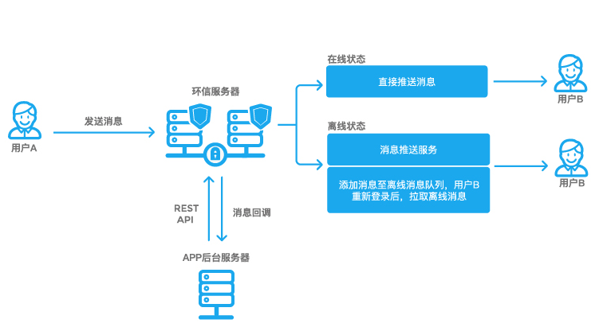
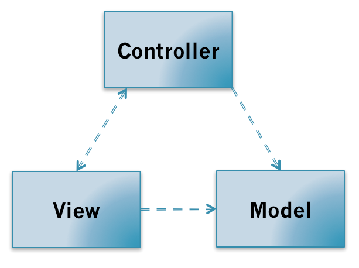
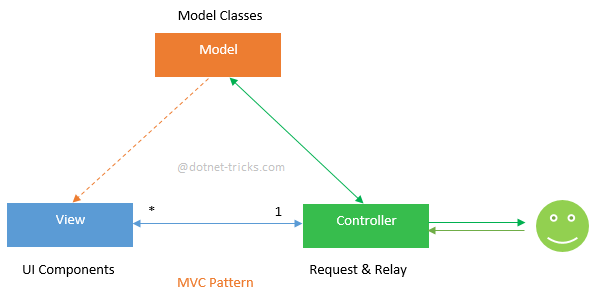
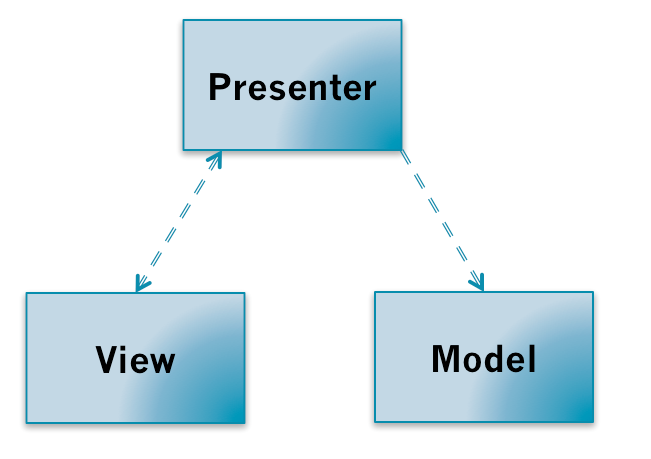
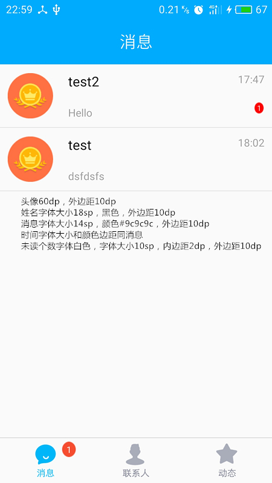

# 项目简介 #
本项目是即时通讯的示例项目，使用了MVP模式，集成了环信SDK和Bmob，展示了即时通讯基本的功能的实现，包括注册登录，退出登录，联系人列表，添加好友，删除好友，收发消息，消息提醒等功能。
## 使用的开源项目 ##
* [BottomBar](https://github.com/roughike/BottomBar)
* [EventBus](https://github.com/greenrobot/EventBus)
* [greenDAO](https://github.com/greenrobot/greenDAO)
* [butterknife](https://github.com/JakeWharton/butterknife)

## 学习目标 ##
* 环信SDK的集成与使用
* MVP模式的运用
* ORM数据库的集成与使用
* 模块化思想的运用

# 即时通讯 IM(Instant Messaging)#
>允许两人或多人使用网路即时的传递文字讯息、档案、语音与视频交流。

## 相关产品 ##
* 鼻祖 ICQ
* 国内主流 QQ 微信 陌陌 YY等
* 国外主流 Facebook Messenger WhatsApp Skype Instagram Line

## 第三方服务平台 ##
* [环信](http://www.easemob.com/product/cs?utm_source=baidu-pp)
* [融云](http://www.rongcloud.cn/)
* [网易云信](http://netease.im/)
* [极光IM](https://www.jiguang.cn/im)
* [腾讯云通信IM](https://www.qcloud.com/product/im.html)
* [爱萌](http://www.imsdk.im/)
* [阿里悟空(2016年10月31号正式下线)](http://www.imwukong.com/)
* [阿里百川云旺](http://im.taobao.com/)

# 环信 #
[官网](http://www.easemob.com/product/cs?utm_source=baidu-pp)

[即时通信云3.x文档](http://docs.easemob.com/im/start)

## Demo使用 ##
测试账号：itheima31(123456) uncleleonfan(123456)

## Demo导入Android Studio ##

## Android SDK的介绍及导入 ##
[官网](http://docs.easemob.com/im/200androidclientintegration/10androidsdkimport)

## Android SDK的基础功能 ##
[官网](http://docs.easemob.com/im/200androidclientintegration/30androidsdkbasics)
### 巨坑 ###
运行出错：Didn't find class "com.hyphenate.chat.adapter.EMACallSession"，原因是hyphenatechat_3.2.0.jar包内没有该类。

解决办法:导入demo里面的hyphenatechat_3.2.0.jar

# 软件架构 #

## MVC ##

MVC应用于Ruby on Rails, Spring Framework, iOS开发和 ASP.NET等。

* Model: 获取数据的业务逻辑，网络操作，数据库操作
* View: UI
* Controller: 操作Model层获取数据传递给UI

### 服务器端的MVC ###

### Android中MVC ###
Android中并没有清晰的MVC框架，如果把Activity当做Controller,根据我们实际开发经验，里面会有大量的UI操作，所以V和C就傻傻分不清了。

* Model:Java Bean, NetworkManager, DataBaseHelper
* View: xml res
* Controller: Activity Fragment
* ArrayList-ListView-Adapter(MVC)

## MVP ##
MVP主要应用于ASP.NET等。**MVP与MVC主要区别是View和Model不再耦合。**

* Model: 获取数据的业务逻辑，网络操作，数据库操作
* View: UI
* Presenter: 操作Model层获取数据传递给UI

## MVVM ##
MVVM主要应用于WPF, Silverlight, Caliburn, nRoute等。

* Model: 获取数据的业务逻辑，网络操作，数据库操作
* View: UI
* ViewModel: 将View和Model绑定

### Android中MVVM ###
[Data Binding Library](https://developer.android.com/topic/libraries/data-binding/index.html)
[中文翻译](http://www.jianshu.com/p/b1df61a4df77)

## 软件架构的核心思想 ##
>分层分模块

## 参考 ##
[MVC,MVP和MVVM模式如何选择](http://www.jianshu.com/p/6a86f7fdc0cb)

[Understanding MVC, MVP and MVVM Design Patterns](http://www.dotnettricks.com/learn/designpatterns/understanding-mvc-mvp-and-mvvm-design-patterns)

[教你认清MVC，MVP和MVVM](http://zjutkz.net/2016/04/13/%E9%80%89%E6%8B%A9%E6%81%90%E6%83%A7%E7%97%87%E7%9A%84%E7%A6%8F%E9%9F%B3%EF%BC%81%E6%95%99%E4%BD%A0%E8%AE%A4%E6%B8%85MVC%EF%BC%8CMVP%E5%92%8CMVVM/)

[Android Data Binding](https://github.com/LyndonChin/MasteringAndroidDataBinding)

[Clean Architecture](http://fernandocejas.com/2014/09/03/architecting-android-the-clean-way/)

# 准备好了么？ 开车啦！！！ #
## 包的创建 ##
## 基类的创建 ##

# Splash界面 #

## 功能需求 ##
1. 如果没有登录，就跳转到登录界面
2. 如果已经登录，则跳转到主界面

# 登录界面 #

## IME ##
android:imeOptions="actionNext"
android:imeOptions="actionGo"

# 注册界面 #
## 云数据库 ##
[LeanCloud](https://leancloud.cn/)
[Bmob](http://www.bmob.cn/)

## Android6.0动态权限管理 ##
[介绍](http://www.jianshu.com/p/a37f4827079a)

# 主界面 #

## 底部导航条 ##
RadioGroup, TabHost, FragmentTabHost, 自定义
## 第三方底部条 ##
[BottomBar](https://github.com/roughike/BottomBar)
[AHBottomNavigation](https://github.com/aurelhubert/ahbottomnavigation)
[BottomNavigation](https://github.com/Ashok-Varma/BottomNavigation)
## Fragment的切换 ##

# 联系人 #

## SlideBar ##
### 绘制居中文本 ###
http://www.cnblogs.com/tianzhijiexian/p/4297664.html

## 添加好友 ##
发送好友申请-->好友同意或者拒绝-->好友同意则写入数据库

### GreenDAO ###
[Github](https://github.com/greenrobot/greenDAO)

[官网](http://greenrobot.org/greendao/)

[AppBrain](http://www.appbrain.com/stats/libraries/details/greendao/greendao)

[使用文档](http://greenrobot.org/greendao/documentation/)

[中文使用文档](http://www.jianshu.com/p/2f7f48563141)

1. 保存联系人
2. 查询联系人
3. 删除联系人
 
### 隐藏软键盘 ###

# 聊天界面 #
[通信过程及聊天记录保存](http://docs.easemob.com/im/000quickstart/25communicationandmessagestorage)
## 发送一条消息 ##

### 动画文件 ###
anim文件夹：补间动画

animator文件夹：属性动画

drawable文件夹：帧动画

	<?xml version="1.0" encoding="utf-8"?>
	<animation-list xmlns:android="http://schemas.android.com/apk/res/android">
	    <item android:drawable="@mipmap/loading1" android:duration="100"/>
	    <item android:drawable="@mipmap/loading2" android:duration="100"/>
	    <item android:drawable="@mipmap/loading3" android:duration="100"/>
	    <item android:drawable="@mipmap/loading4" android:duration="100"/>
	    <item android:drawable="@mipmap/loading5" android:duration="100"/>
	    <item android:drawable="@mipmap/loading6" android:duration="100"/>
	    <item android:drawable="@mipmap/loading7" android:duration="100"/>
	    <item android:drawable="@mipmap/loading8" android:duration="100"/>
	</animation-list>

### .9文件制作 ###

## 接收一条消息 ##

## 初始化聊天数据 ##
[官方文档](http://docs.easemob.com/im/200androidclientintegration/50singlechat)

# 会话界面 #

## 会话界面的MVP实现 ##
## ConversationAdapter的实现 ##
## ConverstationItemView的实现 ##
## 点击会话跳转到聊天界面 ##
## 会话列表未读消息的更新 ##
[官方文档](http://docs.easemob.com/im/200androidclientintegration/50singlechat)
## 聊天界面标记消息已读 ##
## 底部导航条未读消息更新 ##

# 消息通知 #
## 声音  ##

## 通知 ##

# 多设备登录 #
[官方文档](http://docs.easemob.com/im/200androidclientintegration/30androidsdkbasics)